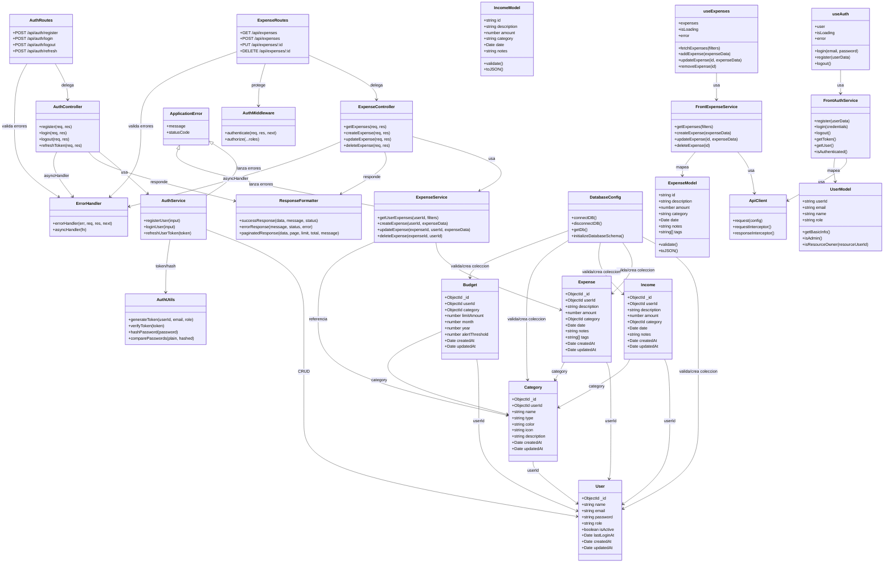

# Diagrama de Clases - Sistema de Control de Gastos e Ingresos

## Objetivo
Este documento define el diagrama de clases de referencia para el proyecto, alineado con la arquitectura:
- Backend: Model-Controller-Service (API REST con Express y Mongoose)
- Frontend: Model-View con Hooks y Services (React)

El diagrama prioriza relaciones reales del codigo actual y relaciones objetivo para la siguiente fase de backend.

## Diagrama (Mermaid)

## Notas de Diseno
- Auth y Expenses estan modelados como el primer vertical slice funcional end-to-end.
- Incomes, Categories, Budgets y Reports ya estan representados en el dominio para escalar sin romper contrato.
- Se mantiene separacion de responsabilidades: Route -> Controller -> Service -> Model.
- El frontend desacopla UI y acceso a datos via Hooks y Services.

## Convenciones recomendadas
- Mantener DTOs de respuesta consistentes con successResponse/errorResponse.
- Evitar logica de negocio en controllers.
- Mantener validaciones duales: frontend (UX) + backend (seguridad y consistencia).
- Usar relaciones por ObjectId para todas las entidades de dominio financiero.
