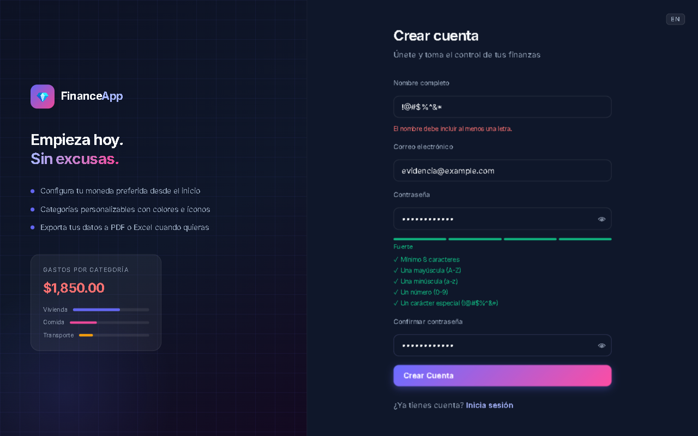
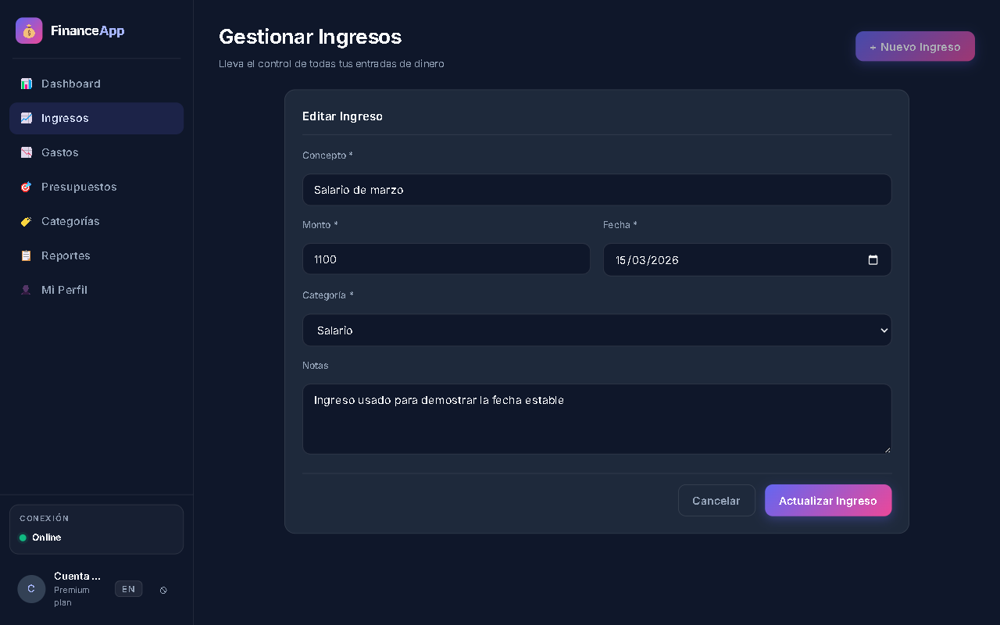
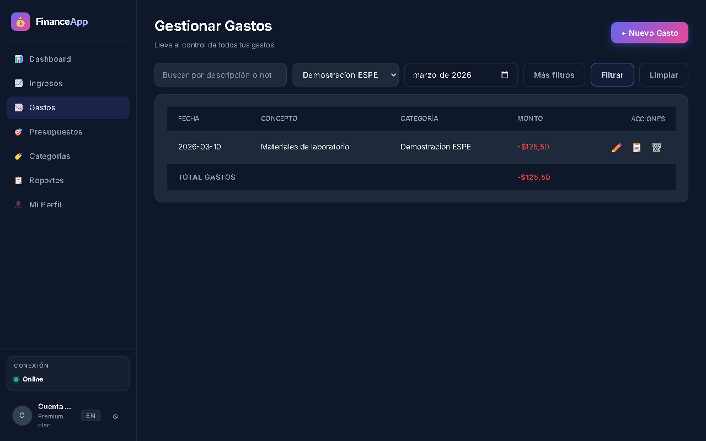
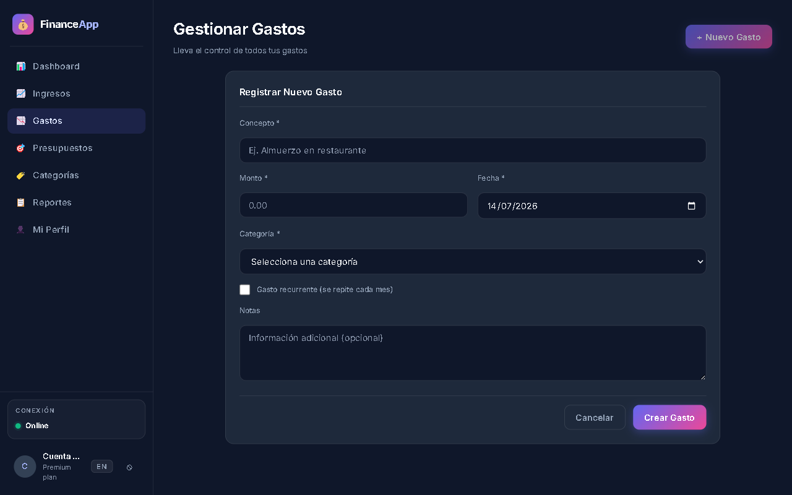
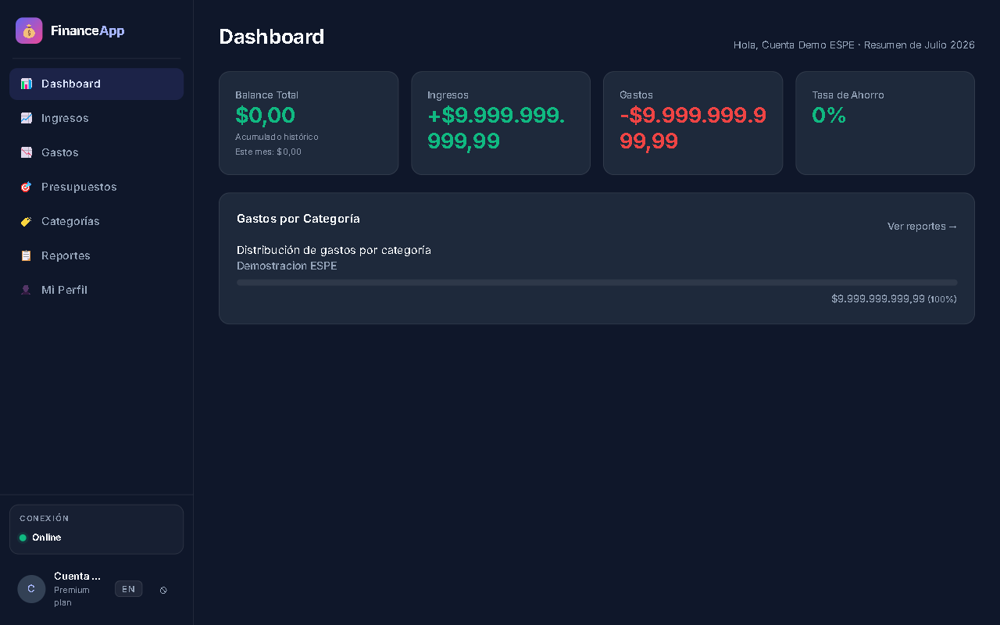
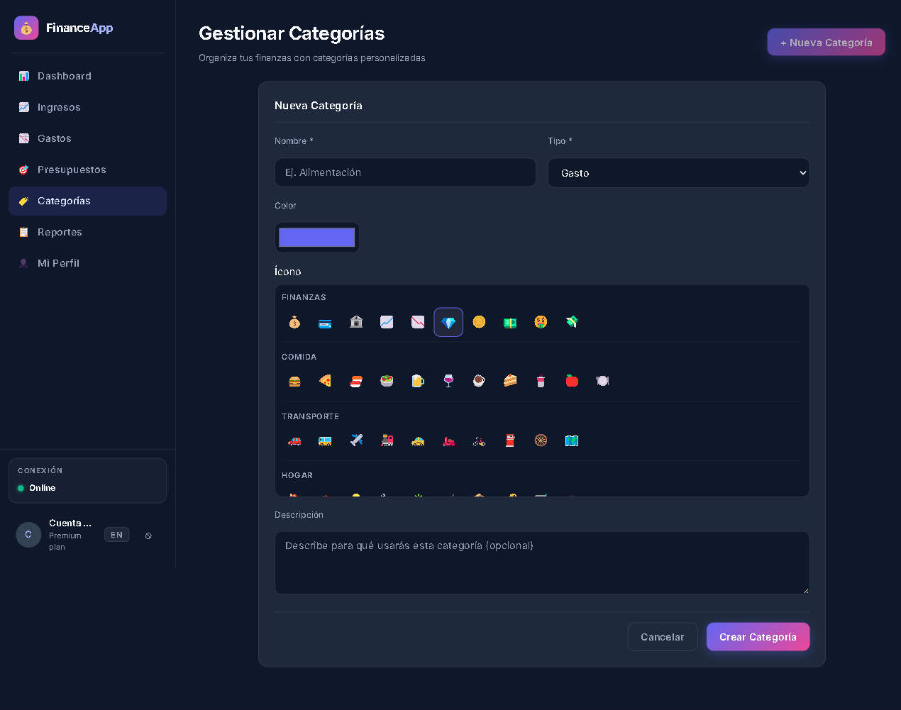

# Índice comparativo de observaciones y correcciones

## Propósito

Este documento contrasta las observaciones registradas en la práctica de laboratorio con el comportamiento actual de FinanceApp. El PDF conserva el estado **Antes** y las capturas generadas por Playwright muestran el estado **Después** con datos controlados y sin información personal.

## Fuentes

- [Rúbrica oficial](referencias/Rubrica.pdf)
- [Práctica de laboratorio con observaciones](referencias/PracticaLab_Pruebas.pdf)
- [Resultados generales de pruebas](RESULTADOS_PRUEBAS.md)
- Automatización de capturas: `installer/tests/rubric-evidence.spec.mjs`

La práctica documentó 20 casos ejecutados, 10 aprobados y 10 fallidos. El estado defendible actual es **9 de las 10 observaciones corregidas (90%)**. La observación de actividad reciente permanece pendiente porque no existe evidencia suficiente para presentarla como solucionada.

## Matriz antes y después

| # | Caso e incidente original | Antes en la práctica | Después verificable | Evidencia automática | Estado |
|---:|---|---|---|---|---|
| 1 | CP-05 / INC-07: nombre compuesto solo por símbolos | Página 9: el registro permitía un nombre sin letras. | El formulario rechaza `!@#$%^&*` y explica que el nombre debe incluir una letra. | Playwright 01; `regression.cy.js` | Corregido |
| 2 | CP-09 / INC-02: edición de ingresos | Página 5: al editar no se recuperaban correctamente los datos. | Concepto, monto, fecha, categoría y notas aparecen precargados. | Playwright 02; `regression.cy.js` | Corregido |
| 3 | CP-10 / INC-03: desfase de fecha | Páginas 3 y 5-6: una fecha podía mostrarse como el día anterior. | La fecha `2026-03-15` conserva exactamente el mismo día en la edición. | Playwright 03; `incomes.cy.js` | Corregido |
| 4 | CP-12 / INC-04: filtros de categoría y mes | Página 6: seleccionar filtros no producía el resultado esperado. | La vista mantiene `Demostración ESPE` y marzo de 2026 como filtros aplicados. | Playwright 04; `expenses.cy.js` | Corregido |
| 5 | CP-13 / INC-04: marzo omitido | Página 6: marzo no aparecía correctamente entre los resultados. | El registro del `2026-03-10` aparece al filtrar marzo de 2026. | Playwright 05; `expenses.cy.js` | Corregido |
| 6 | CP-14 / INC-07: selector de categoría duplicado | Páginas 9-10: el formulario presentaba dos selectores. | El formulario actual contiene exactamente un selector de categoría. | Playwright 06; `regression.cy.js` | Corregido |
| 7 | CP-16 / INC-05: monto alto omitido | Página 7: cantidades altas no se reflejaban en el dashboard. | Ingresos y gastos muestran `9.999.999.999,99`. | Playwright 07; `dashboard.cy.js` | Corregido |
| 8 | CP-17 / INC-05: desbordamiento de tarjetas | Página 7: el texto numérico salía de su tarjeta. | El monto se adapta dentro de la tarjeta sin superar su ancho. | Playwright 08; comprobación `scrollWidth <= clientWidth` | Corregido |
| 9 | CP-18 / INC-06: actividad reciente | Página 8: el panel no mostraba el historial esperado. | No existe evidencia actual suficiente para afirmar que fue corregido. | Sin captura deliberadamente | **Pendiente** |
| 10 | CP-20 / INC-07: selección de iconos | Páginas 9-10: el icono debía copiarse y pegarse manualmente. | El formulario ofrece un selector visual agrupado y conserva una sola opción marcada. | Playwright 10; `categories.cy.js` | Corregido |

## Evidencia visual actual

### 1. Validación del nombre



Qué demuestra: el usuario no puede continuar con un nombre sin letras y recibe una explicación concreta. Es una corrección funcional de validación, no solamente un cambio visual.

### 2 y 3. Edición de ingresos y fecha estable



Qué demuestra: el ingreso recupera concepto, monto, categoría, notas y la fecha exacta `15/03/2026`. La captura 03 reproduce el mismo estado específicamente para conservar una evidencia independiente de la fecha.

### 4 y 5. Filtros y presencia de marzo



Qué demuestra: ambos controles conservan la selección y la tabla presenta una transacción fechada `2026-03-10`. La captura 05 conserva una evidencia independiente del resultado de marzo.

### 6. Selector de categoría único



Qué demuestra: el formulario contiene un único control para escoger la categoría. Playwright cuenta el selector antes de guardar la imagen.

### 7 y 8. Montos altos contenidos



Qué demuestra: las cantidades altas se representan en ingresos y gastos y se ajustan en dos líneas sin invadir otras tarjetas. Playwright comprueba geométricamente que el ancho desplazable de cada monto no sea mayor que el ancho disponible.

### 10. Selector visual de iconos



Qué demuestra: ya no es necesario copiar y pegar un emoji. El formulario ofrece grupos de iconos y mantiene exactamente uno marcado con borde visible.

## Cómo reproducir las capturas

Desde la raíz del repositorio:

```powershell
cd installer
npm install
npx playwright test tests/rubric-evidence.spec.mjs
```

La configuración levanta Vite en `127.0.0.1:3000`, abre FinanceApp mediante Electron y Playwright, intercepta únicamente la API de esa ejecución con datos deterministas y sobrescribe las imágenes de `evidencias/capturas-rubrica/`.

La automatización no modifica la base real, no usa contraseñas reales y no genera videos.

## Cómo presentarlo

1. Abrir la página del incidente en `PracticaLab_Pruebas.pdf`.
2. Explicar en una frase el impacto anterior.
3. Mostrar la captura numerada correspondiente.
4. Señalar el elemento visible que cambió.
5. Mencionar la prueba Cypress o Playwright que hace repetible la comprobación.
6. Para actividad reciente, reconocer que permanece pendiente en lugar de afirmar una corrección no demostrada.

Ultima verificación visual: 14 de julio de 2026, resolución base 1280 x 800.
