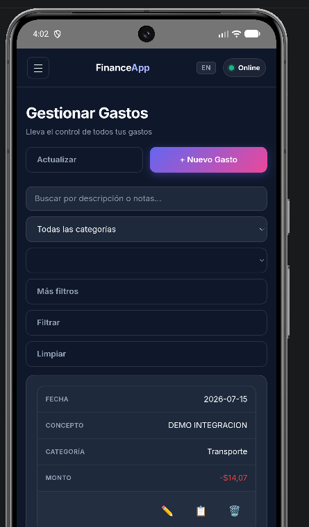
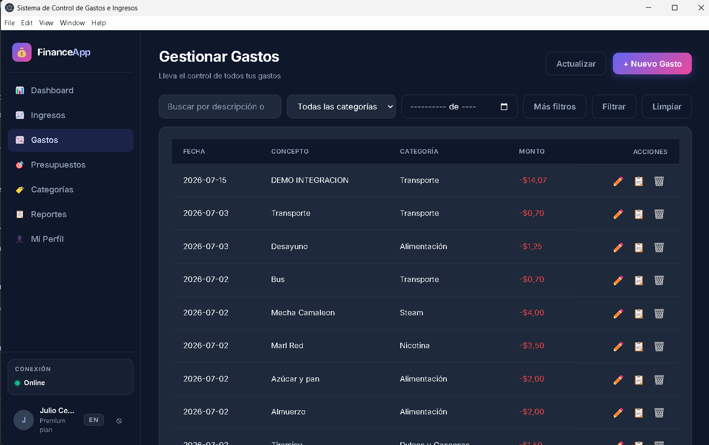
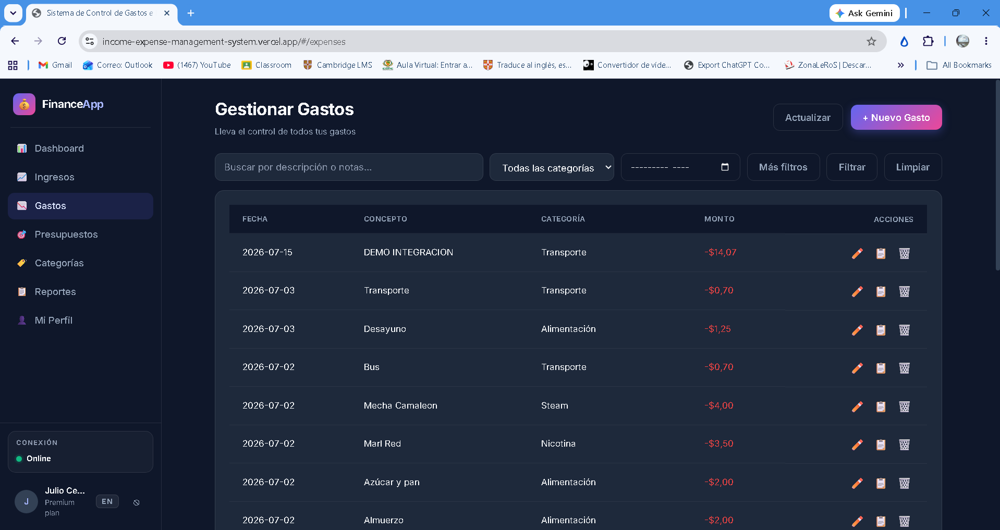

# Evidencia de integración entre web, Android y Electron

## Caso documentado

Las tres capturas muestran el mismo gasto persistido mediante la API y la base
de datos compartidas:

| Campo | Valor observado |
|---|---|
| Concepto | `DEMO INTEGRACION` |
| Fecha | `2026-07-15` |
| Categoría | `Transporte` |
| Monto | `$14,07` |

Además del registro común, las tres interfaces muestran el estado `Online` y
el botón `Actualizar`. Esto permite explicar que React se reutiliza en los tres
clientes y que cada uno puede solicitar nuevamente el estado de la API sin
cambiar de pantalla.

## Archivos fuente verificados

| Cliente | Archivo | Resolución | SHA-256 |
|---|---|---:|---|
| Android | `capturas-presentacion/integracion-android-real.png` | 445 × 760 | `F7902C4707D18B9A7D32778C2DFE7BF711163344F48D9B24397B90F6758BB873` |
| Electron | `capturas-presentacion/integracion-electron-real.png` | 1571 × 988 | `20DF11287ED9270A3A8AB3A28A9C584F51246CF1DEA89853B8E76D5AA7C5ED8C` |
| Web | `capturas-presentacion/integracion-web-real.png` | 1918 × 1017 | `449E56942BD40C9EFBFB9F50B71B9B7919DBF4B030A3BB9B444A806457501D39` |

## Android — Pixel 8 Pro

- Fuente: aplicación Capacitor ejecutada en el emulador Pixel 8 Pro.
- Se observa la adaptación móvil de filtros y del gasto a una tarjeta vertical.
- El concepto, la fecha y la categoría coinciden con los otros clientes.
- El botón `Actualizar` permanece visible y táctil en el ancho móvil.

## Escritorio — Electron

- Fuente: cliente Electron de FinanceApp en Windows.
- Se observa el marco de la aplicación de escritorio, no una pestaña del navegador.
- Fecha, concepto, categoría y monto coinciden con la versión web.
- El botón `Actualizar` aparece junto a `Nuevo Gasto`.

## Web desplegada

- Fuente: `income-expense-management-system.vercel.app/#/expenses`.
- La barra del navegador mantiene visible el contexto de la aplicación desplegada.
- El registro y su monto coinciden con Android y Electron.
- El botón `Actualizar` permite solicitar los datos sin navegar a otra sección.

## Trazabilidad técnica

| Evidencia | Resultado verificado el 14/07/2026 |
|---|---:|
| Unitarias web, incluido `useDataRefresh` | 28/28 |
| Cypress completo | 78/78 |
| Casos Cypress de Gastos | 16/16 |
| Pruebas Node del instalador y soporte de evidencias | 14/14 |
| Smoke Electron en modo QA | 1/1 |
| Smoke del release `app://financeapp/` | 1/1 |

Las pruebas de refresco comprueban el intervalo de 30 segundos, los eventos de
foco, visibilidad y reconexión, la deduplicación de solicitudes, la actualización
manual, la pausa con formularios abiertos y la conservación de filtros.

## Alcance y límites

- Las capturas demuestran una lectura consistente del mismo registro en tres
  clientes reales; no identifican por sí solas cuál cliente creó el dato.
- La presencia del botón no demuestra su lógica interna. Esa conducta está
  respaldada por Vitest y Cypress.
- La captura móvil es evidencia manual del emulador. La navegación Android aún
  no está automatizada con una prueba instrumentada.
- No se muestran tokens, contraseñas ni valores privados de archivos `.env`.
